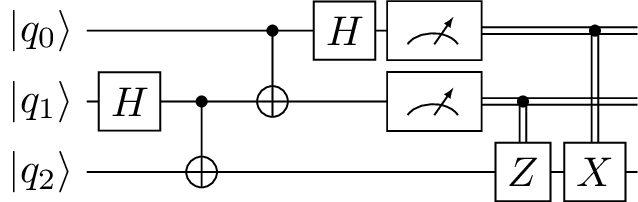
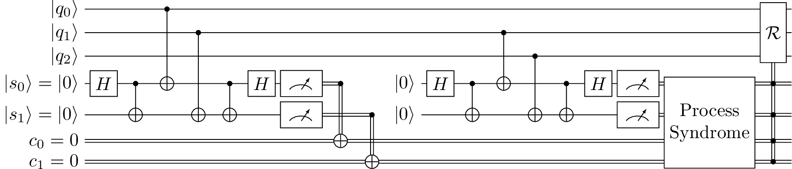

# yquant
Typesetting quantum circuits in a human-readable language

yquant is a LaTeX package that allows to quickly draw quantum circuits. It bridges the gap between the two groups of packages that already exist: those that use a logic-oriented custom language, which is then translated into TeX by means of an external program; and the pure TeX versions that mainly provide some macros to allow for an easier input.
yquant is a pure-LaTeX solution - i.e., it requires no external program - that introduces a logic oriented language and thus brings the best of both worlds together.
It builds on and interacts with TiKZ, which brings an enourmous flexibility for customization of individual circuit.

A detailed reference with lots of examples is provided in the PDF version of this Readme. We will sketch some basic usage.

## Examples
Much more examples and explanations can be found in the PDF version of this Readme.

### Simple teleportation circuit

```LaTeX
\begin{tikzpicture}
  \begin{yquant}
    qubit {$\ket{\reg_{\idx}}$} q[3];

    h q[1];
    cnot q[2] | q[1];
    cnot q[1] | q[0];
    h q[0];
    measure q[0], q[1];

    z q[2] | q[1];
    x q[2] | q[0];
  \end{yquant}
\end{tikzpicture}
```

### Three-qubit phase estimation circuit with QFT and controlled-U

```LaTeX
\begin{tikzpicture}
  \begin{yquant}
    qubit {$\ket{j_{\idx}} = \ket0$} j[3];
    qubit {$\ket{s_{\idx}}$} s[2];

    h j;
    box {$U^4$} (s) | j[0];
    box {$U^2$} (s) | j[1];
    box {$U$} (s) | j[2];
    h j[0];
    box {$S$} j[1] | j[0];
    h j[1];
    box {$T$} j[2] | j[0];
    box {$S$} j[2] | j[1];
    h j[2];
    measure j;
  \end{yquant}
\end{tikzpicture}
```

### Three-qubit FT QEC circuit with syndrome measurement

```LaTeX
\begin{tikzpicture}
  \begin{yquant}
    qubit {$\ket{q_{\idx}}$} q[3];
    qubit {$\ket{s_{\idx}} = \ket0$} s[2];
    cbit {$c_{\idx} = 0$} c[2];

    h s[0];
    cnot s[1] | s[0];
    cnot s[0] | q[0];
    cnot s[1] | q[1];
    cnot s[1] | s[0];
    h s[0];
    measure s;
    cnot c[0] | s[0];
    cnot c[1] | s[1];
    discard s;

    init {$\ket0$} s;
    h s[0];
    cnot s[1] | s[0];
    cnot s[0] | q[1];
    cnot s[1] | q[2];
    cnot s[1] | s[0];
    h s[0];
    measure s;

    box {Process\\Syndrome} (s, c);
    box {$\mathcal R$} (q) | s, c;
  \end{yquant}
\end{tikzpicture}
```

### Error correction

```LaTeX
% \usetikzlibrary{fit, quotes}
\begin{tikzpicture}
  \begin{yquant}
    qubit {} msg[3];
    [name=inits]
    qubit {$\ket0$} syndrome[3];

    [name=scnot0]
    cnot syndrome[0] | msg[0];
    cnot syndrome[0] | msg[1];
    cnot syndrome[1] | msg[1];
    cnot syndrome[1] | msg[2];
    cnot syndrome[2] | msg[0];
    cnot syndrome[2] | msg[2];
    [name=smeas]
    dmeter {$M_{\symbol{\numexpr`a+\idx}}$} syndrome;
    ["Recovery"]
    box {$\mathcal R$} (msg) | syndrome;
    discard syndrome;
  \end{yquant}
  \node[draw, dashed, fit=(inits-2) (scnot0-p0) (smeas-2), "Syndrome Measurement"] {};
\end{tikzpicture}
```

### Lots of controls

```LaTeX
\begin{tikzpicture}
   \begin{yquant*}
      zz (a[0], a[2]);
      cnot a[1] ~ a[0];
      zz (a[2], a[3]);
      h a[3] | a[0] ~ a[1];
      measure a[2], a[3];
      box {$U$} (a[0], a[1]) | a[3] ~ a[2];
      discard a[2], a[3];
   \end{yquant*}
\end{tikzpicture}
```